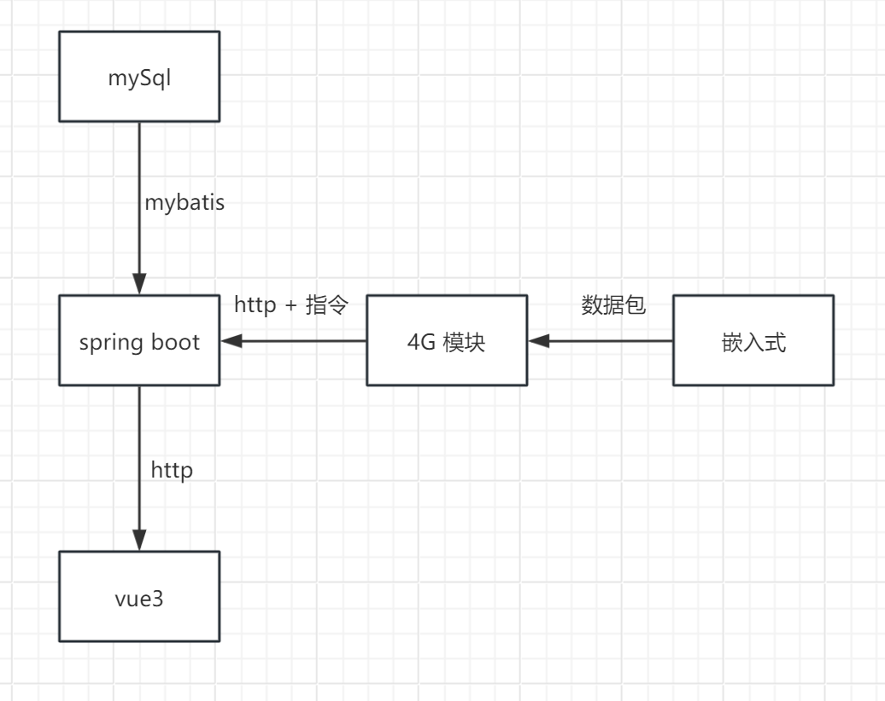

# WaterDetection(渔场水质监测系统)

## 简介

- 嵌入式系统：
  本地系统实现PH值、温度、溶解氧监测，按后续需求添加浑浊度TDS等；
  本系统屏幕实时显示检测到的数据；
  本系统数据异常处理及自动报警，数据异常时判断是否在线，若离线系统优先自主处理如果系统处理之后数据恢复正常不会报警；在线时听从云平台调度；
- 服务端：
  服务端负责数据存储、检测功能，并且可以自定义上报数据类型
  服务端可以检测数据、若数据异常可以向预留手机、邮件发送信息；可以根据配置规则下饭执行命令
- 网页端：
  网页端则提供直观的可视化界面，用户可轻松查看数据趋势，进行设备配置

## 背景及意义

此项目所要实现的功能主要有以下几个方面：

### 1.水质检测

水质是影响养殖效益和生态环境的关键因素之一。通过对水质进行实时监测和检测，养殖户可以及时了解水质状况，采取相应的措施来维护水质，保障养殖生物的健康和生长。

### 2.数据异常警报

通过监测设备实时采集水质数据，并设置数据异常警报机制，可以在水质异常情况下及时发出警报，帮助养殖户及时处理问题，减少损失。

### 3.云端存储日志

将监测数据存储在云端数据库中，可以实现数据的长期保存和备份，养殖户可以随时查看历史数据，分析水质变化趋势，为养殖管理提供参考。

### 4.数据可视化

通过数据可视化技术，将监测数据以图表、曲线等形式直观展示，帮助养殖户更直观地了解水质情况，及时作出决策。

### 5.数据处理

对监测数据进行处理和分析，可以帮助养殖户更好地理解水质情况，发现潜在问题并采取相应措施，提高养殖效益。

### 6.人机交互

通过人机交互界面，养殖户可以方便地查看监测数据、设定报警阈值、进行数据分析等操作，提高管理效率。

### 7.报警阈值自定义

允许养殖户自定义报警阈值，根据具体需求和养殖环境设定不同的阈值，确保及时发现异常情况。

___

综上所述，实现上述功能可以帮助渔业养殖户实现水质监测、数据管理和养殖效益提升，提高养殖管理的科学性、智能化和效率，为养殖业的可持续发展提供技术支持和保障。同时，通过这些功能的实现，也能够提升养殖户对养殖环境的管理水平，减少养殖过程中的风险和损失，促进渔业养殖业的健康发展。

___

## 实现方法以及思路

### 1.硬件思路

### 2.嵌入式思路

嵌入式思路指的是本系统的驱动思路

#### 整体思路

初始化完成后能自动同步云端配置数据，实现数据异常时自动按照配置执行操作

使用非阻塞延时+状态机的程序架构可以实现周期性检测这样可以实现一秒一次检测，空闲时用来刷新OLED屏幕

4G模块嫁接服务器与嵌入式的的桥梁，其中实现命令解析，http响应，数据上等功能

程序还使用了许多结构体与函数指针增加了程序可读性、延展性、维护性。

#### 循环队列的作用

串口循环队列接收部分，主要用途是用于接收云端命令，这种结构可以接收数据量较大的命令，可以根据接收数据量的大小更改QUEUE_MAX的大小，同样的循环队列发送部分是为了响应云端，程序中uart、oled以及状态机都采用了类似的封装方法。

#### 定时器10ms中断

刚开始使用的中断时间就是1ms，结果就是串口正常工作的波特率特别低，9600都会出现很多错误，找了很久才发现是定时器中断过于占用资源（主要还是stm32用习惯了），改成10ms后数据就正常传输了。

#### 服务端思路

## 数据包
  
### 指令包

### 应答包

### 心跳包

## 嵌入式数据包指令集

- / write {name} {value}

  表示更改配置，需要和外部存储器交互

  | {name}    | 解释        | 值类型                  | 数据大小(bit) |
           |-----------|-----------|----------------------|-----------|
  | url       | 表示会话的服务器  | string ascii         | 128       |
  | username  | 表示用户名     | string [8-32] ascii  | 32        |
  | password  | 表示用户密码    | string [8-32] ascii  | 32        |
  | equipment | 表示当前设备的名称 | string [1-32] utf-16 | 64        |

- / write rule {dataTypeName} {exceptionUpper} {warnUpper} {warnLower} {exceptionLower}

  用来同步规则

  |                  | 解释                | 值类型      |  
        |------------------|-------------------|----------|
  | {dataTypeName}   | 对应数据类型的名称         | string   |
  | {exceptionUpper} | 异常上界              | float    |
  | {warnUpper}      | 警告上界              | float    |
  | {warnLower}      | 警告下界              | float    |
  | {exceptionLower} | 异常下界              | float    |

- / write command {commandId} {dataTypeName} {actuatorName} {commandTrigger} {upper} {low}

  同步命令

  |                  | 解释        | 值类型    |  
  |------------------|-----------|--------|
  | {commandId}         | 指令的ID     | uint32_t |
  | {dataTypeName}   | 对应数据类型的名称 | string |
  | {actuatorName}   | 触发执行器的名称  | string |
  | {commandTrigger} | 触发器       | enum   |

-
    - commandTrigger 选项
      ON_EXCEPTION|
      ON_WARN|
      NORMAL|
      HIGH|
      LOW|
      TRIGGER|
      COMMAND_TRIGGER

- / read {name}

  表示返回当前配置的信息，需要和外部存储器交互 执行命令同 /write

- / get {name} {name2?}

  表示读取当前缓存的值

  | {name}       | 解释            | {name2?} | 值类型      |
        |--------------|---------------|----------|----------|
  | dataType     | 表示当前缓存传感器的值   | 数据类型的名称  | float    | 
  | dataTypeList | 表示支持所有传感器的名称  | null     | string[] |
  | actuator     | 表示当前缓存执行器是否开启 | 执行器的名称   | uint8_t  | 
  | actuatorList | 表示支持所有传感器的名称  | null     | string[] |

- / start {actuatorName} {time}

  表示开启特定的执行器

- / stop {actuatorName} {time}

  表示停止特定的执行器

- /initEnd

  表示初始化结束

- /syncEnd

  表示同步完成

- 应答模板 > {SUCCESSFUL/FAIL} {information}
- 心跳模板 ~

## 服务端命令

- / time

  获得当前的时间

## 服务器命令（仅嵌入式）

- / report {dataTypeName} {value}

- / update rule {dataTypeName} {exceptionUpper} {warnUpper} {warnLower} {exceptionLower}

- / update command {commandId} {dataTypeName} {actuatorName} {commandTrigger} {upper} {low}

## 网页

- / new

  表示有新的设备接入，需要更新
